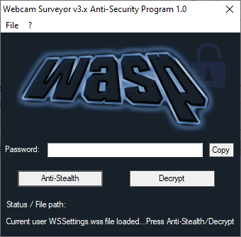

## WASP

[Webcam Surveyor](https://www.webcamsurveyor.com) v3.x Anti-Security Program. Reverse engineering PoC code / recovery tool.

### Screenshot & demo




https://user-images.githubusercontent.com/95986479/161860676-db2be6d4-d14c-4455-a8fb-191b3f65d107.mp4


### Overview

WASP is a program for revealing Webcam Surveyor stealth mode key combination and password decryption. It is made mainly as a reverse engineering demo, but it could also serve as a recovery tool.   

When the WASP runs, current user WSSettings.wss file is loaded, but you can also load settings file obtained from another location (e.g another user, PC etc...).

### Usage

1. _Anti-Stealth_ - reveals stealth mode key combination
2. _Decrypt_ - decrypts password

From the _File_ menu, you can use _Open other WSSettings.wss file..._ option to load settings file from another location.

### How to build

Install either GCC or MSVC compiler and set PATH environment variable correctly to point to your chosen compiler, then run **build.bat** script. The script prefers GCC, but if it is not available it will try to build using MSVC.

This program is intended to be compiled as a **32-bit** binary, so make sure you have set your compiler to output **32-bit** image.

### Tested / Affected versions

WASP is tested on following Webcam Surveyor versions:  

**3.6.6, 3.7.0, 3.8.4, 3.8.6, 3.9.0**

but it should work on other (untested) versions too.

### Note on antivirus

Your antivirus software may flag this program as a malware or potentially unwanted program (PUP).   
Please ignore this, and add it to your antivirus exclusion list.

### Support

[](bitcoin:bc1qjwedefp3xruv7qak72l89hzx5mx0c0ftq8qem7)

If you would like to see more projects like this one, please consider supporting me :)  

Donate bitcoin to the following address:


```
bc1qjwedefp3xruv7qak72l89hzx5mx0c0ftq8qem7
```
